## Questions

**Q:** **What kind of model did you build, and why did you choose that particular approach?** \
**A:**  U-Net. It is a well-known baseline for segmentation tasks, originally developed for cell segmentation. 
This architecture is relatively simple, not very computationally demanding and has many open source implementations, 
making it suitable for quickly testing hypotheses. I used the implementation from https://github.com/milesial/Pytorch-UNet

**Q:** **How much training data does that model need?**\
**A:** I achieved the best results by training for 8 epochs using 97 images (only Fused_S1_1.tif), 
resulting in a total of 776 training samples with rotation augmentation.

**Q:** **If you used some pre-trained model weights?** \
**A:** No.

**Q:** **Where in your approach (if at all) you took into account that protein and lipid channels are disjoint modalities?** \
**A:** Not taken into account.

**Q: Where in your approach you used (if at all) the prior assumptions about:**
  - **elliptical shape of the nuclei**\
  **A:** I filtered nuclei masks predictions based on the ratio between the perimeter and the square root of the enclosed area. See [nuclei_demo.py](nuclei_demo.py) line 176.
  - **continuity of the shape**\
  **A:** Not used.
  - **the expected range of area**\
  **A:** Excluded the shapes with area less than certain threshold.
  - **information from adjacent nuclei / inter-nuclear distance**\
  **A:** Not used.
  - **information about tubules (manually annotated)** \
  **A:** I extracted individual tubules from the images based on manually annotated masks and used these individual tubule 
  images with rotation augmentations as training samples. 
  Please, see [notebooks/nuclei_demo.ipynb](notebooks/nuclei_demo.ipynb) for more details.
 
  Square crop single tubule:

|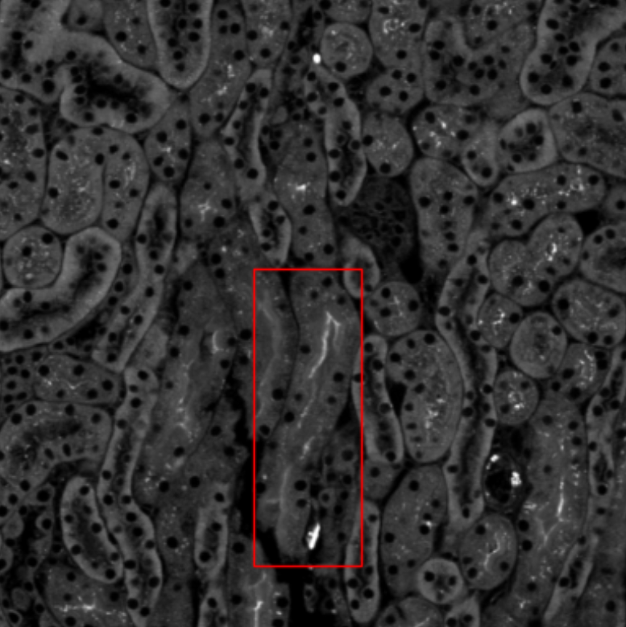| 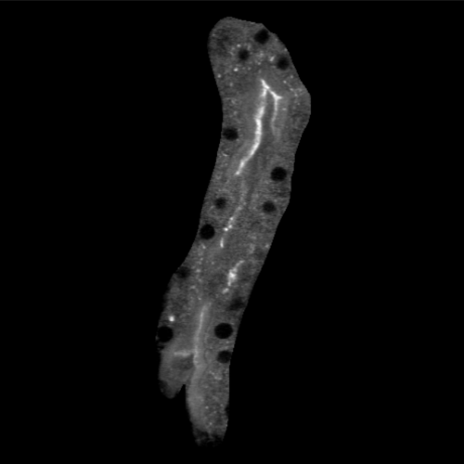 |
:-------------------------:|:-------------------------------------------------:|

Train model on randomly rotated tubule crops:

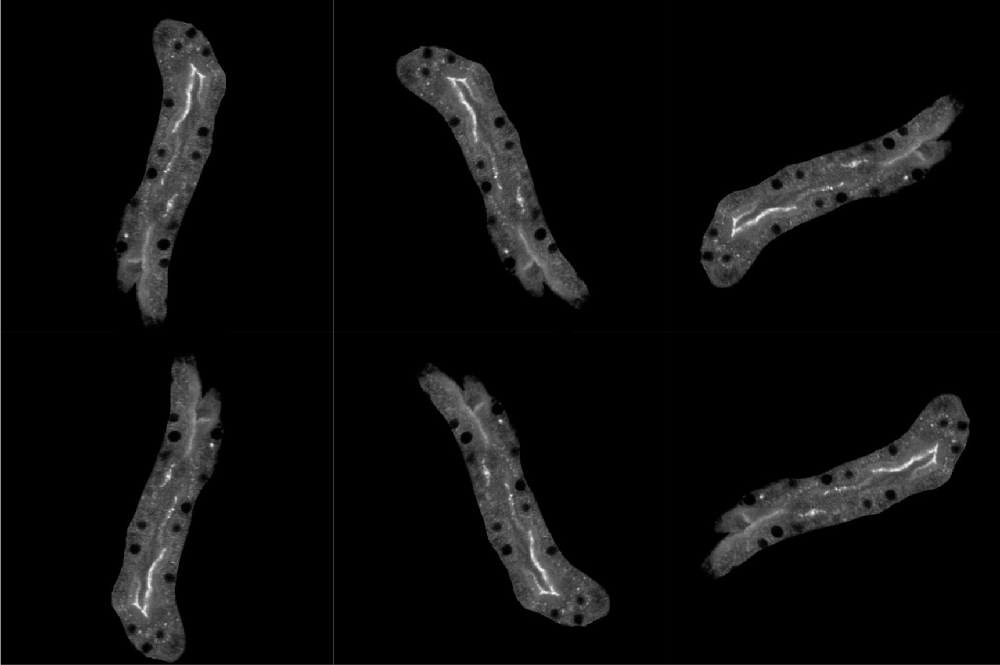

Get predictions for individual tubules:

| 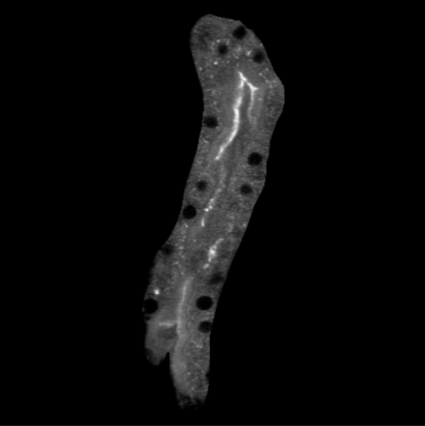 | 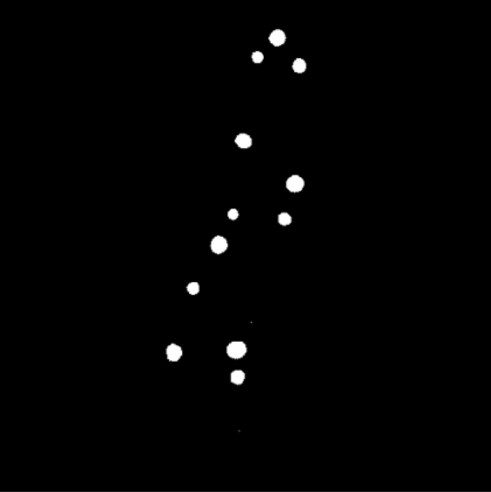 |
:------------------------------------------------------:|:---------------------------------------:|

After that, insert obtained individual masks on their positions on a larger image.

**Q:** **If you take into account the imperfection of human manual annotation (missing or inaccurate annotations)**? \
**A:** I fully annotated tubules for the first image [Fused_S1_1_Mask.png](doc/Fused_S1_1_Mask.png):

[//]: # (![Fused_S1_1_Mask.png]&#40;.data/8bit_nuclei/Fused_S1_1_Mask.png&#41;)

<div>
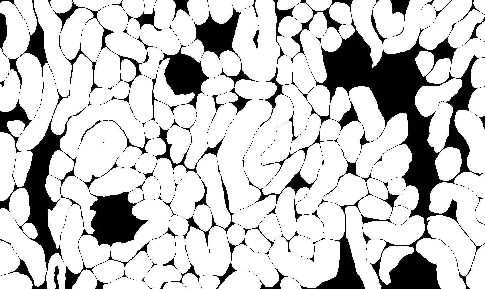
</div>


I used [Label Studio](https://labelstud.io/) with SAM backend locally. 
However, this tool turned out to be poorly optimized for rendering multiple brush labels. 
I wrote some scripts that partially helped to overcome this issue. 
Nevertheless, the tool becomes very laggy when more than 15 segmentation masks are rendered simultaneously, 
making it unreasonable for such tasks. 
I attempted to connect SAM to a local instance of [CVAT](https://www.cvat.ai/), but was unsuccessful.

I removed individual tubule segmentation masks that I considered to be artifacts:

|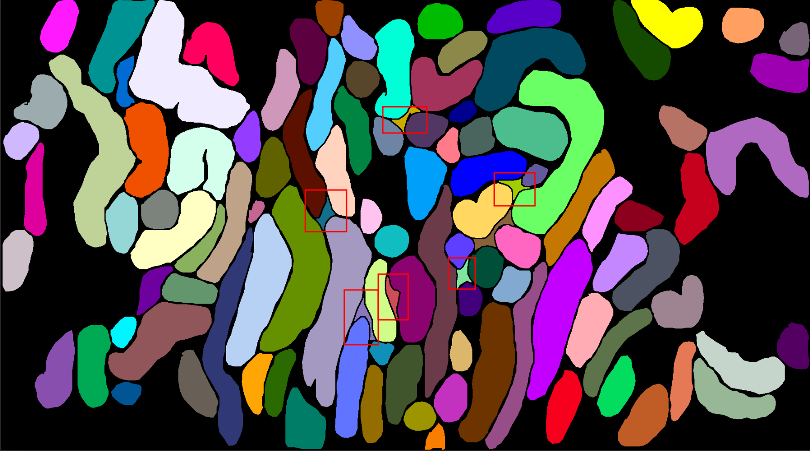| 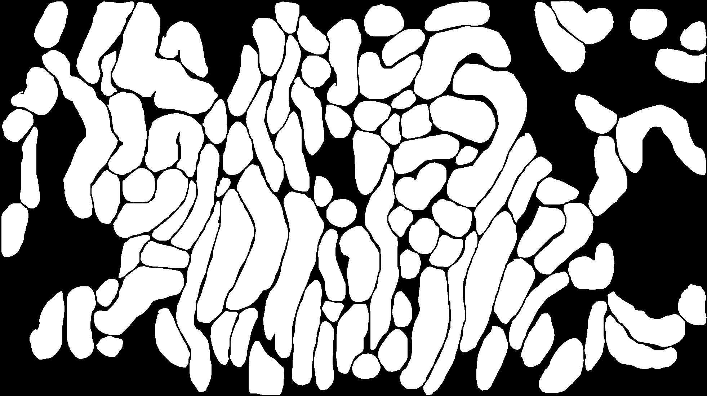 |
:-------------------------:|:-------------------------------------------:|

I wrote the method masks_split_contours to extract individual tubule instances if they have the same pixel value. 
This is necessary if there are more than 254 masks in the original annotations, as they are saved in 8-bit format (Fused_S10_4).
<div>
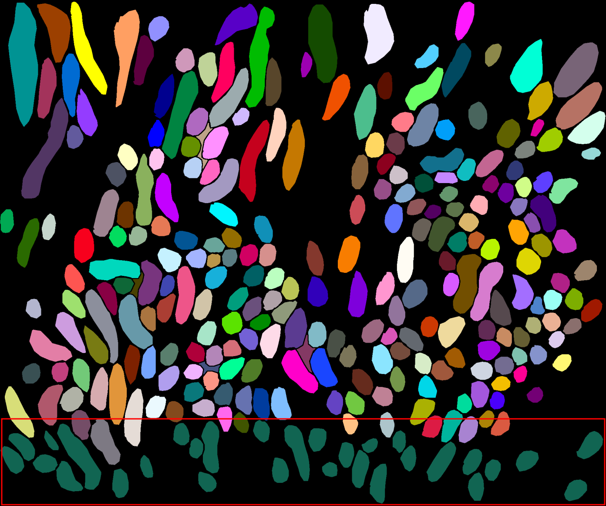
</div>

**Q:** **How would your code change if the dimensions of input files change, the number of input layers changes, if lipid and protein channels swap, if the range of measured values changes?** \
**A:** I used single channel 8 bit images which I converted from 16 bit using [Fiji](https://imagej.net/software/fiji/).
   One can get a slice from numpy array after reading original `tiff` 7-channel images like so:
```python
image_name = "Fused_S1_1.tif"
image_fp = os.path.join(DATA_DIR, image_name)
channels = [1, 2, 5] # say, we need protein, lipid and LTL channels
img = sci.io.imread(image_fp)[channels]
```
The model will need to be retrained with the corresponding number of input channels:
```python
model = Unet(img.shape[0], 1)
...
```

**Q:** **Which channels are more informative for nuclei segmentation?** \
**A:** I used single channel lipid input as the nuclei are more prominent there for a human eye, 
though I haven't tested other channels and combinations.  

**Q:** **Which accuracy metrics you used and why, and what are the resulting metrics' values of your model?** \
**A:** Average dice coefficient over evaluation samples. It is widely used to measure pixel-wise agreement between 
a predicted segmentation and its corresponding ground truth. The best epoch showed a Dice score of approximately 0.79.
However, I noticed that this metric didn't correspond well with the actual accuracy of predicted mask that I observed by eye.
I plan to investigate this issue.

**Q:** **What are your suggestions on how you could further improve your model and how we could improve the annotation?** \
**A:** My suggestion is to improve tubules annotation quality using SAM pretrained model and nuclei annotations using the above U-Net 
model. 
I plan to:
- Draw bounding boxes for already annotated (automatically, using available masks) and missing tubules (manually, using CVAT).
- Predict masks with pretrained SAM using those bboxes as prompts.
- Convert SAM predicted masks to CVAT format.
- Manually correct any inaccuracies in the SAM predictions.

Example of SAM predictions with bboxes as prompts:
<div>
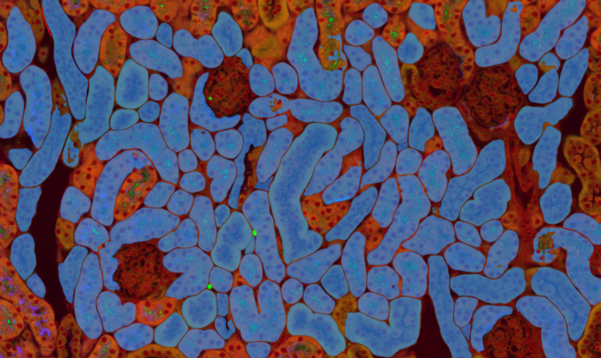
</div>

The same approach can be applied to nuclei and brushes. 
By having three-channel masks (for tubules, nuclei, and brushes) for images, we could finetune SAM 
(and also test other architectures such as Detectron2 or pretrained U-Net from Cellpose) 
end-to-end to predict these three-channel masks. 
This could be achieved given a multichannel input, for example, protein, lipid, and LTL channels.

## Installation

Clone the repository
```
git clone git@github.com:boldyshev/kidney-nori.git
cd kidney-nori
```

Create virtual environment
```
python3 -m venv .venv
source .venv/bin/activate
pip install -r requirements.txt
```

Download the processed tubules masks and the checkpoint of the pretrained U-Net.
```
mkdir .data
mkdir -p .saved_models/unet_nuclei
gdown 1NxfwkW86ZRmplRxdFBI52chAUAFIvzKm -O .data/8bit_nuclei.zip
unzip .data/8bit_nuclei.zip -d .data 
gdown 1YlB_sXh9dOP_1rRmQo28SrQDBzWLziaV -O .saved_models/unet_nuclei/unet_nuclei_epoch8.pth
```


## Predict nuclei masks

Command line
```
python3 nuclei_demo.py <IMAGE_NAME> # e.g. Fused_S1_2.tif
```

Jupyter notebook with some details: [notebooks/nuclei_demo.ipynb](notebooks/nuclei_demo.ipynb)

Results:\
Whole image nuclei masks predictions

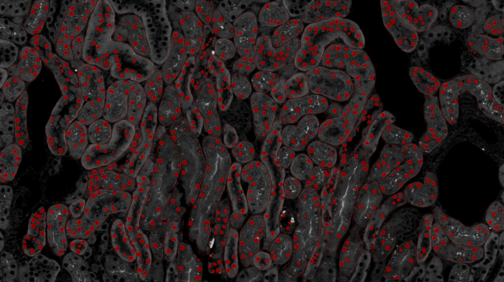

[//]: # (<div>)
[//]: # ()
[//]: # (</div>)

Plots of nuclei areas and perimeters distribution:

<div>
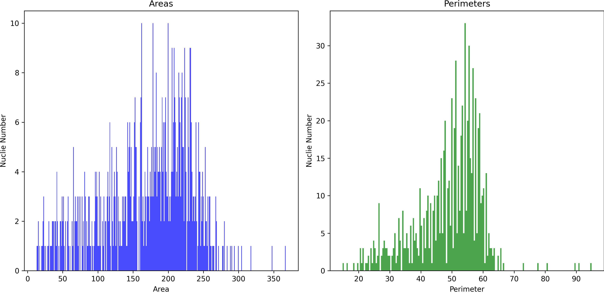
</div>


